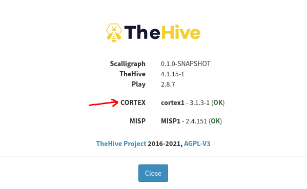
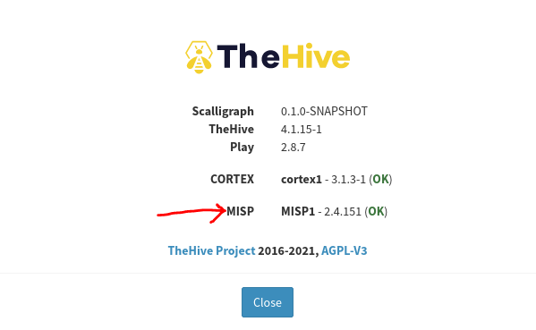

# 🤝HIRE US FOR FULL IMPLEMENTATION🤝
Contact Info: archan.fiem.it@gmail.com, hk.sainaga@gmail.com

# Integration Guide:
We will Integrate all of the components as per the architecture diagram

## ELK-TheHive:
  - First, let’s create a webhook destination in ELK. 

| Key | Value |
| --- | --- |
| Content-Type | application/json |
| Authorization | Bearer API-KEY |
  - To generate an authorization key we need to access to TheHive web application and login as an admin and create a new user and create API key for that user. You should provide Org-Admin Role for the user
  - Once Done, please test the connector with below-
```bash
{
"title" : "My Auto case",
"description" : "A VPN user has connected from a foreign country"
"tlp" : 3,
"tags" : [“automatic”, “creation”]
}
```
  - Once you run above, you should see a successful case created on TheHive Console.

## TheHive-Cortex:
  - Login to Cortex UI and Create a user. Give it Org-Admin Role and create a API key for that user.
  - SSH to the EC2 where TheHive is running and adjust the configuration file here- /etc/thehive/application.conf
  ```bash
  cortex {
    servers: [
      name: "Cortex1"
      url: "http://Cortex-VM-IP:9001"
      auth {
        type: "bearer"
        key: "PASTE YOUR NEWLY CREATED KEY"
      }
    ]
  }
  ```
  - Restart Hive Service and refresh the browser. Go to About> You will see Cortex is OK Status. Like below:

<p align="center">  </p>

## TheHive-MISP:
  - Login to the MISP UI and go to Administration > List Auth Key
  - You need to create a new key, so hit **Add Authentication Key** Button > You can give some IP to secure the connection > Submit
  - Copy the key and store it (NOTE- Once you close the Window, MISP will musk the key and you won't be able to see it again)
  - SSH to the EC2 where TheHive is running and adjust the configuration file here- /etc/thehive/application.conf
 ```bash
 misp {
    interval: 1m
    servers: [
      name: "MISP"
      url: "http://MISP-VM-IP/"
      auth {
        type: "key"
        key: "PASTE YOUR NEWLY CREATED KEY"
      }
      wsConfig
      wsConfig.ssl.loose.acceptAnyCertificate: true #Add This line to bypass the cert check 
    ]
  }
 ```
 - Restart Hive Service and refresh the browser. Go to About> You will see MISP is OK Status. Like below:

<p align="center">  </p>

## Cortex-MISP
  - Login to MISP UI
  - You need to create a new key, so hit **Add Authentication Key** Button > You can give some IP to secure the connection > Submit
  - Copy the key and store it (NOTE- Once you close the Window, MISP will musk the key and you won't be able to see it again)
  - Login to Cortex UI and go to Organization > Analyzers > Search for MISP > Click Enable
  - Provide below-

| Key | Value |
| --- | --- |
| Name | As you like |
| url | MISP IP |
| key | newly Created API Key |
| cert_check | False |
  - Refresh the Cortex web UI and you will see MISP is appreaing in the New Analysis section after choosing a Observable
